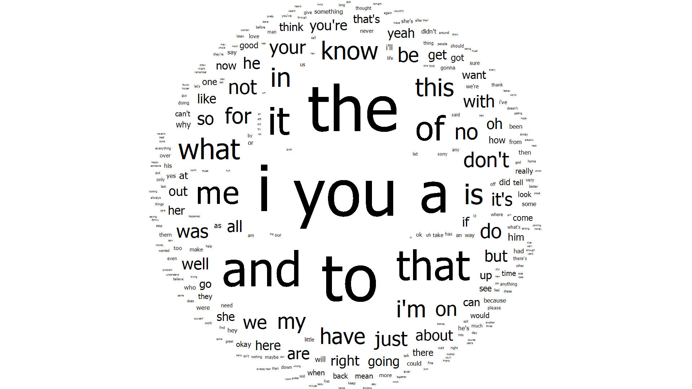
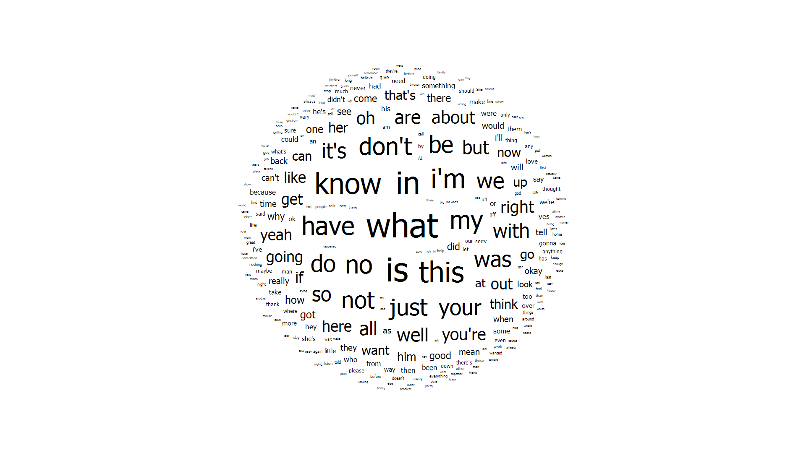
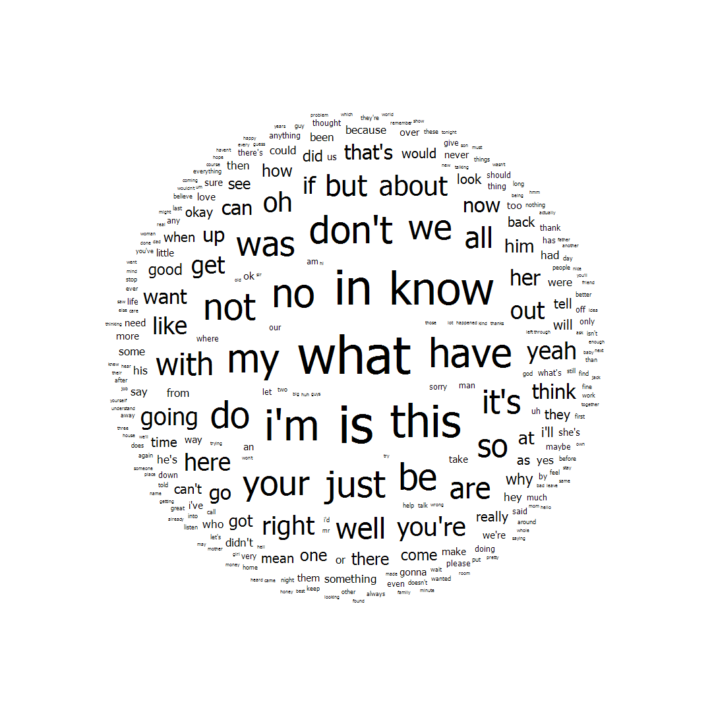
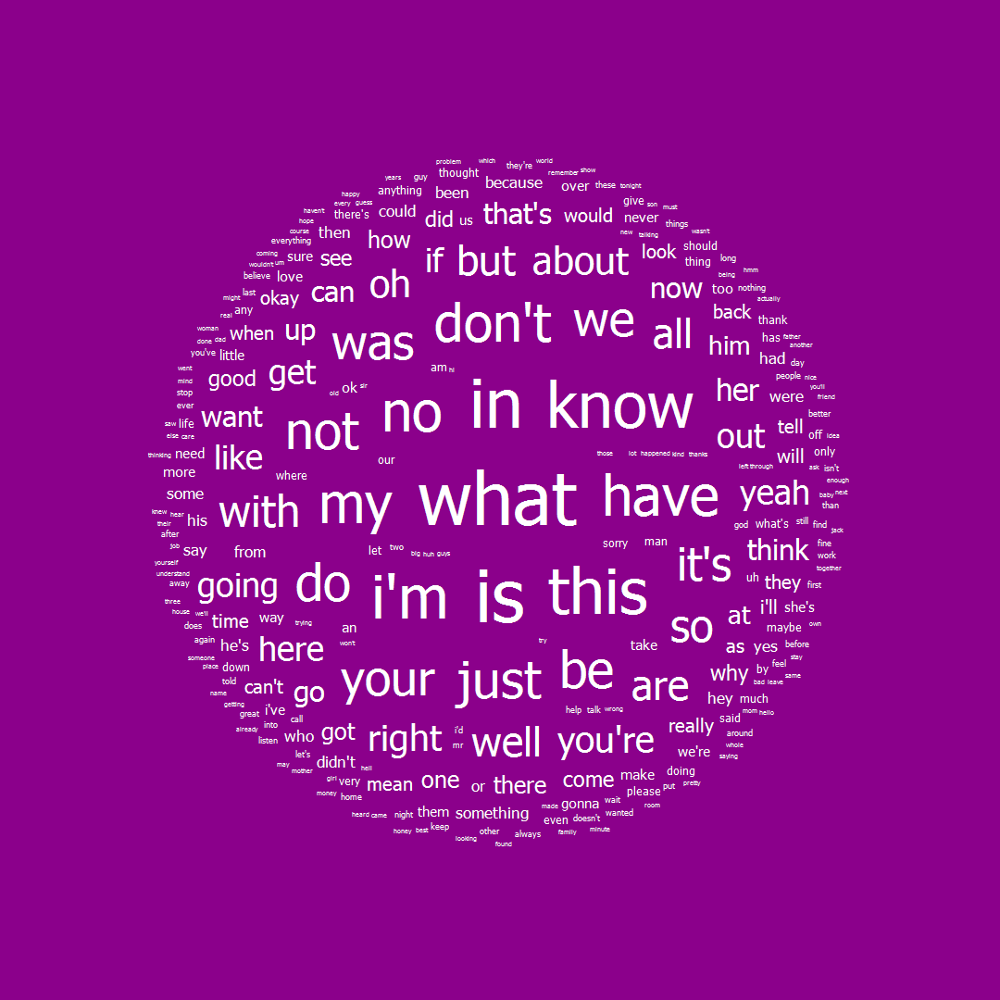

#### TagsCloudVisualization.exe -t wordsStats.txt

#### TagsCloudVisualization.exe -t wordsStats.txt --filter fordibbenWords.txt

#### TagsCloudVisualization.exe -t wordsStats.txt --filter fordibbenWords.txt -s 0.05 -w 1080

#### TagsCloudVisualization.exe -t wordsStats.txt --filter fordibbenWords.txt -s 0.05 -w 1080 -b DarkMagenta -c white

